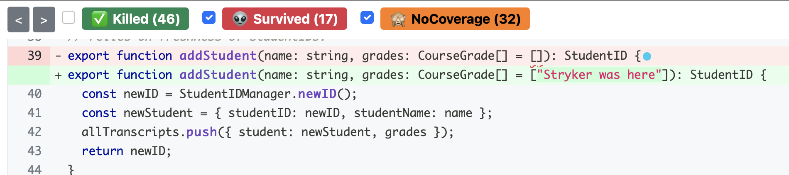

# Test Adequacy Activity
We will gain experience improving test suites using two adequacy criteria: line coverage and mutation coverage. The instructions reference line numbers in transcriptManager.ts. Do *not* change that file while you are following along, or else you may find that the line referenced do not match what you see.

## First steps:
After install (`npm install`), `npm test` executes the test suite:

```
$ npm test

> transcript-server-openapi@1.0.0 test
> jest --coverage

 PASS  src/transcriptManager.spec.ts
  TranscriptManager
    Create student
      ✓ should return an ID, starting with 1 (2 ms)
    Adding grades
      ✓ should add the grade to the transcript (1 ms)
      ✓ Should throw an error if the student ID is invalid (12 ms)
    getStudentIDs
      ✓ Should return only the students who match the name (1 ms)
    Deleting students
      ✓ Should result in the students' transcript no longer being available (1 ms)
      ✓ Should throw an error if the ID is invalid (1 ms)
    getAll
      ✓ Should return the transcripts

----------------------|---------|----------|---------|---------|-------------------
File                  | % Stmts | % Branch | % Funcs | % Lines | Uncovered Line #s 
----------------------|---------|----------|---------|---------|-------------------
All files             |   83.01 |       60 |   84.21 |   84.78 |                   
 transcriptManager.ts |   83.01 |       60 |   84.21 |   84.78 | 18-21,76,85,95    
----------------------|---------|----------|---------|---------|-------------------
Test Suites: 1 passed, 1 total
Tests:       7 passed, 7 total
Snapshots:   0 total
Time:        0.971 s, estimated 1 s
Ran all test suites.
```

This output shows the tests that ran, the percentage of statements/branches/functions/lined covered, and the lines not covered.

Examine the tests in the file `transcriptManager.spec.ts`, and the implementation in `transcriptManager.ts`. 

## line Coverage

First examine the lines that are not covered in `transcriptManger.ts`, and enhance the tests so that they are covered.  For our purposes, we won't  care about lines 18-21 (they are not relevant to the spec). Hence, your goal is to cover lines 76, 85, and 95.

As you implement tests, think about how your tests reflect the principles of "good tests" that we discussed in class.

As an example, there is one "TODO" that points out what is likely a bad assumption of a starter test: the order of transcripts returned by `getStudentIDs` is always in the order the students were added. Do you think that this is a reasonable assumption? Is it worth the effort to change the test, or would you leave it as it is?

## Mutation Coverage

As you implemented your tests with line coverage in mind, you may have noticed that there are many different tests which would cover those lines and that some of those might have been stronger than others.

Mutation coverage helps us spot weak tests. Run `npm run stryker`. This should take no longer than a minute. You should see quite a bit of output, ending with something like this:

```

[Survived] ArrayDeclaration
src/transcriptManager.ts:11:36
-   let allTranscripts: Transcript[] = [];
+   let allTranscripts: Transcript[] = ["Stryker was here"];
Ran all tests for this mutant.

[Survived] ConditionalExpression
src/transcriptManager.ts:94:7
-     if (theGrade === undefined) {
+     if (false) {
Tests ran:
    TranscriptManager Adding grades should add the grade to the transcript


Ran 1.17 tests per mutant on average.
----------------------|---------|----------|-----------|------------|----------|---------|
File                  | % score | # killed | # timeout | # survived | # no cov | # error |
----------------------|---------|----------|-----------|------------|----------|---------|
All files             |   48.42 |       46 |         0 |         17 |       32 |       0 |
 transcriptManager.ts |   48.42 |       46 |         0 |         17 |       32 |       0 |
----------------------|---------|----------|-----------|------------|----------|---------|
21:33:14 (41688) INFO DashboardReporter The report was not send to the dashboard. The dashboard.project and/or dashboard.version values were missing and not detected to be running on a build server.
21:33:14 (41688) INFO HtmlReporter Your report can be found at: file:///Users/Avery/Documents/NEU/CS4530/test-adequacy-activity/reports/mutation/mutation.html
21:33:14 (41688) INFO MutationTestExecutor Done in 11 seconds.
```

Open the HTML report (copy/paste the URL into a browswer). Click on `transcriptManager.ts` to see the report. Examine the mutants that are not detected (again, ignoring lines 18-22). The first "survived" (not detected) mutant should be on line 39. Clicking on the red dot will reveal the mutation:


This report shows that Stryker changed line 39 to default the student's starting transcript to be an array with the single element `"Stryker was here"`. This mutation was not detected by the test suite: there is no test that will fail if the student transcript were initialized to be anything besides an empty array!

To enhance the test suite to detect this mutant, add a test that adds a new student to the `db`, and then expects that the student's transcript is empty.

After you add the new test, run `npm run stryker` again to get an updated mutation report, and reload it in your browser. You should now see that the mutation on the line is "killed" (show the "killed" mutants by clicking "killed" in the filter bar at the top).

Examine the remaining mutants that are not detected, and consider writing tests that will detect them. For each, think about how the mutated program behavior would differ, and how you could detect that difference. Remember that some mutations might be "equivalent"; that they do not cause any detectable behavioral difference. 

Some mutants might cause an observable difference in behavior, but if they are outside of a reasonable specification, they may not matter. For example, do you think that we should write tests that expect that each error message has some particular format?


## Requirements
Please improve the tests so that lines 76, 85, 95 are covered. Also, examine remaining mutants that are not detected and write tests that will detect them. When you are done, create a zip file and submit it.